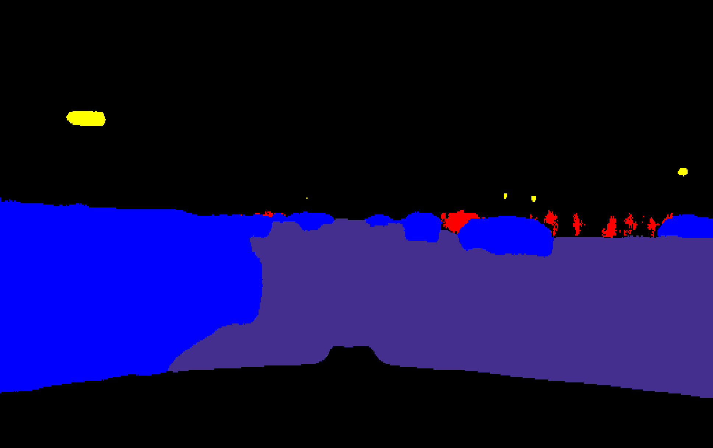

# チームVertical Beach 動作方法

## SDカードの準備 
提出ファイルに含まれる`sd.img`をddコマンドを用いてSDカードに書き込みます．  
SDカードには`BOOT`と`rootfs`の2つのパーティションが作成されます．

## 起動
Ultra96ボードに作成したSDカードを挿入，電源・DisplayPortアダプタ・USBキーボード・マウスを接続します．  
電源を投入します．

## アプリケーションの起動
起動後，Terminalを起動します．  
```bash
cd fpn_eval
./segmentation
...
[INFO] Store : ../seg_out/test_645.png
[INFO] Store : ../seg_out/test_646.png
[INFO] Store : ../seg_out/test_647.png
[INFO] Store : ../seg_out/test_648.png
[INFO] Average elapsed time of inference for the 1th to 649th : 57.928 ms
```
テスト画像に対する推論結果はSDカードの`/home/root/seg_out/`ディレクトリに生成されます．  

## 出力ファイルの確認
**※こちらの作業はホストPC上で実行してください．**  
実機アプリケーションによる出力ファイルは，テスト画像と同じ解像度(1216*1936)のBGR3チャネル画像になっており，評価用のJSONファイルと等価なデータです．
BGRのうちBlueの画素値が識別されたインデックスを表しており，それぞれ`0:road 1:pedestrian 2:signal 3:car 4:others`を意味します．
出力ファイルを色付きのラベル画像に変換させるためにホストPC上で以下を実行します．  
```bash
tar xvf source.tar.gz
cd make_label_img
#SDカードのseg_outディレクトリを'results'ディレクトリにコピーします
#入力：results/test_000.png ... results/test_648.png
#出力：label/test_000.png ... label/test_648.png
cp -r /media/<username>/rootfs/seg_out ./results
sh compile.sh
./a.out
```
以上により，`make_label_img/label`ディレクトリにラベル画像が生成されます．  
出力画像例：  

## 提出用JSONファイルの作成
**※こちらの作業はホストPC上で実行してください．**  
SIGNATEコンテストページのデータタブからダウンロードできる`seg_codes/make_submit.py`を使用します．
```bash
unzip seg_codes.zip
cd seg_codes
python make_submit.py -p <make_label_img path>/label
```
生成された`submit.json`ファイルが評価用の最終データとなります．

## 動画用アプリケーション
動画データを入力として，リアルタイムでセグメンテーションを実行するアプリケーションを開発しました．
ターミナル上で以下のように実行できます．動画再生中にQキーで処理を中断することができます．
```bash
cd fpn_video
#画面の解像度を640x480に変更
sh change_resolution.sh
#リアルタイムセグメンテーションを実行
./segmentation ../movie_480p/morning.mp4
#または
./segmentation ../movie_480p/night.mp4
```
デモ動画：  
[](http://www.youtube.com/watch?v=0OF19EB_FHQ "")
